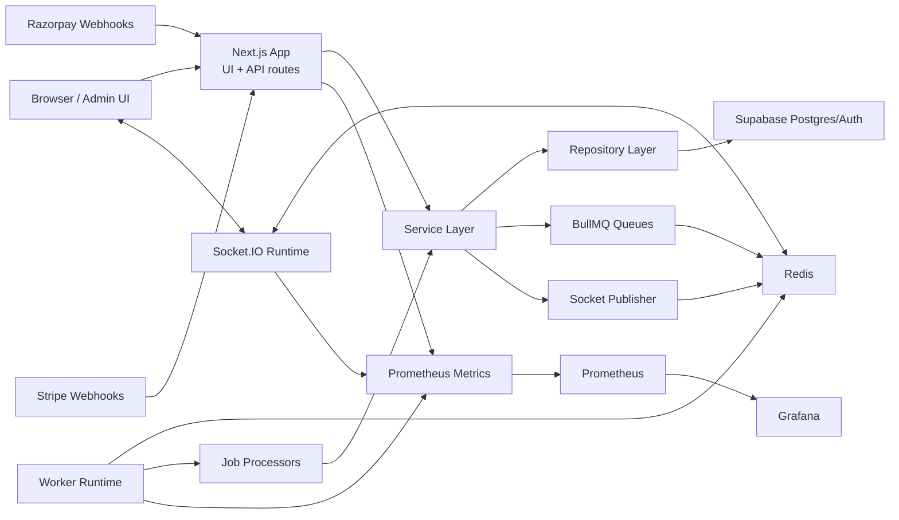
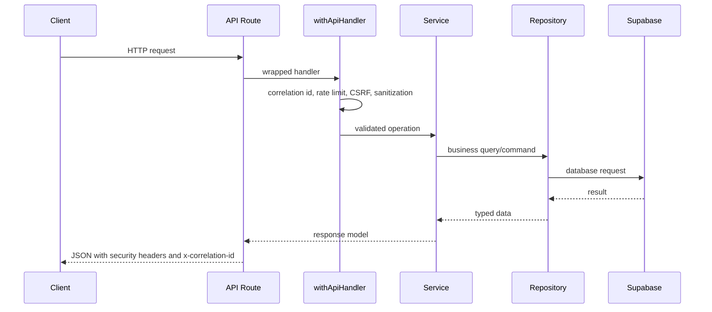
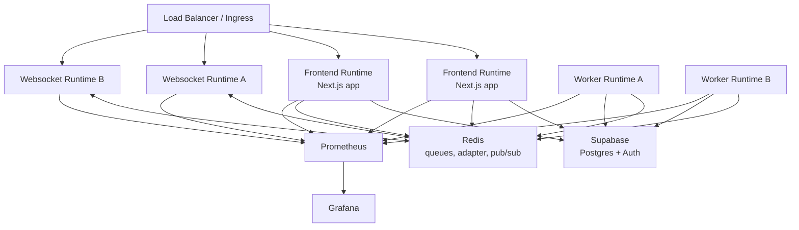
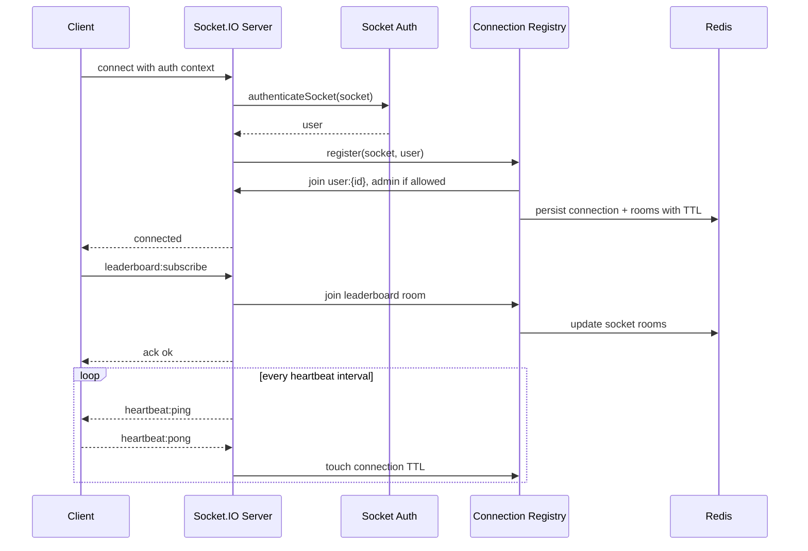
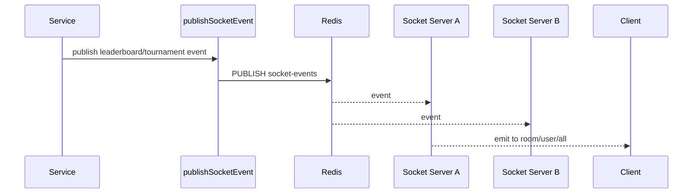
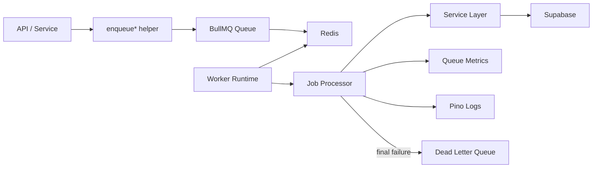
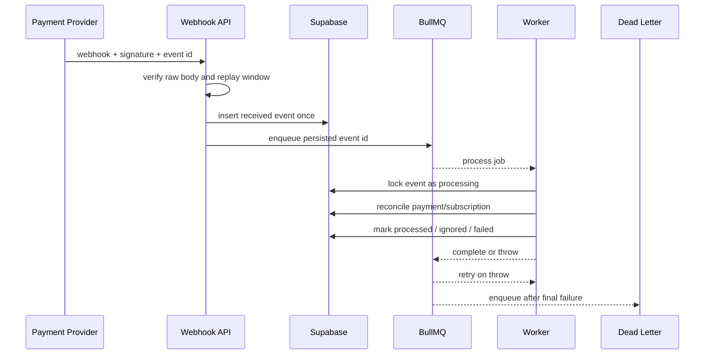
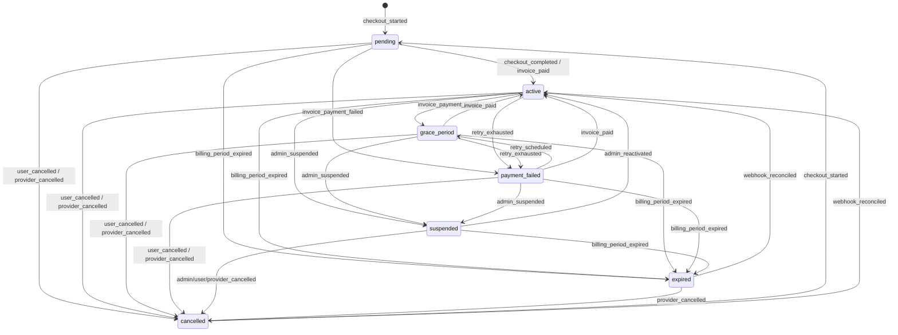
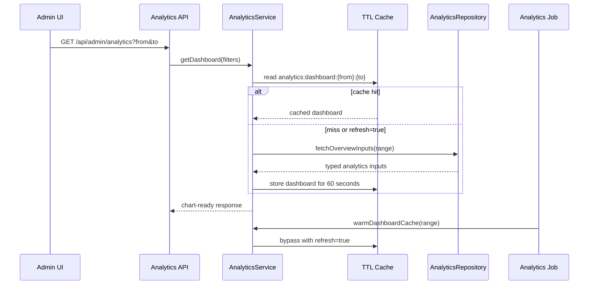
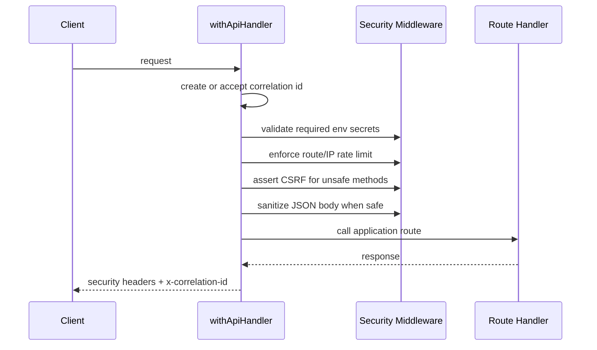

# Golf Charity Platform

Production-oriented Next.js platform for golf subscription payments, charity draws, leaderboards, realtime tournament updates, analytics, and operational back-office workflows.

The codebase is organized as a modular application with thin API route handlers, service and repository layers, BullMQ background workers, a standalone Socket.IO realtime service, Redis-backed queues/pub-sub, Supabase persistence, and Prometheus/Grafana observability.

## Table Of Contents

- [Architecture Overview](#architecture-overview)
- [Key Engineering Decisions](#key-engineering-decisions)
- [Architectural Principles](#architectural-principles)
- [System Design](#system-design)
- [Deployment Topology](#deployment-topology)
- [Websocket Architecture](#websocket-architecture)
- [Queue Processing](#queue-processing)
- [Failure Handling](#failure-handling)
- [Subscription Lifecycle](#subscription-lifecycle)
- [Analytics Dashboard](#analytics-dashboard)
- [API Documentation](#api-documentation)
- [Authorization Model](#authorization-model)
- [Environment Setup](#environment-setup)
- [Local Development](#local-development)
- [Docker Setup](#docker-setup)
- [Observability](#observability)
- [Security Practices](#security-practices)
- [Testing](#testing)
- [Scaling Considerations](#scaling-considerations)
- [Current Limitations](#current-limitations)
- [CI/CD](#cicd)

## Architecture Overview

The application has four runtime surfaces:

| Runtime | Command | Responsibility |
| --- | --- | --- |
| Next.js app | `npm run dev`, `npm run start` | Web UI, API routes, auth flows, dashboards, payment entrypoints |
| Worker | `npm run worker` | BullMQ consumers for email, billing, draws, analytics, leaderboards, webhooks, dead-letter processing |
| Websocket server | `npm run socket` | Socket.IO server, authenticated rooms, heartbeat, Redis adapter, Redis pub/sub broadcasts |
| Observability stack | `docker compose -f observability/docker-compose.yml up` | Prometheus scraping and Grafana dashboards |

Primary modules follow this shape:

```text
src/app/api/*              Next.js route handlers
src/modules/*              Dependency wiring for services and repositories
src/services/*             Business logic and orchestration
src/repositories/*         Supabase data access
src/queues/*               BullMQ queues and worker factories
src/jobs/*                 Queue job processors
src/websocket/*            Socket.IO server, rooms, auth, publishers
src/observability/*        Pino context, Prometheus metrics, metrics HTTP server
src/security/*             Headers, CSRF, sanitization, env validation, upload validation
tests/*                    Jest, Supertest, service, repository, payment, websocket tests
```

## Key Engineering Decisions

| Decision | Rationale | Tradeoff |
| --- | --- | --- |
| BullMQ for background work | Payment reconciliation, draw execution, email, analytics, and leaderboard recalculation should not block API requests. BullMQ gives retries, delayed jobs, concurrency controls, and operational visibility using Redis. | Redis becomes part of the critical runtime path for async processing. Jobs must be written as idempotent units because retries are expected. |
| Redis pub/sub for socket broadcasts | Services and workers need to publish realtime events without owning websocket connections directly. Redis pub/sub lets any runtime publish to all websocket instances through `socket-events`. | Pub/sub is best-effort. If a socket instance is offline during a publish, the event is not replayed by this layer. Durable events should still be persisted separately. |
| Thin API controllers | Route handlers stay focused on auth, input parsing, and response formatting. Business behavior lives in `src/services`, and persistence lives in `src/repositories`. | More files are involved in a feature, but testing and refactoring are safer because the route layer is small. |
| Standalone websocket runtime | Socket.IO maintains long-lived connections and has different scaling and health concerns than request/response APIs. Running it separately avoids coupling websocket capacity to frontend API capacity. | Deployment needs another process and port. Load balancers may need websocket upgrade and sticky-session configuration depending on platform. |
| Observability-first runtime wiring | Correlation IDs, structured logs, and Prometheus metrics are built into API, worker, and websocket paths so production failures can be traced across async boundaries. | Instrumentation adds some boilerplate and must be kept consistent when new runtimes or routes are added. |

These choices keep the Next.js API mostly stateless, move retryable work out of request paths, and allow API, worker, and websocket capacity to scale independently.

## Architectural Principles

- Thin controllers: API routes should authenticate, parse inputs, call one service operation, and return a response.
- Service-oriented business logic: subscription transitions, webhook reconciliation, analytics aggregation, draw execution, and leaderboard behavior belong in `src/services`.
- Repository-based persistence: database access is isolated in `src/repositories` to keep Supabase queries out of controllers.
- Async-first processing: payment webhooks, analytics, draws, email, and billing events should be queue-friendly and retry-safe.
- Stateless API instances: durable state should live in Supabase or Redis, not in a Next.js process.
- Horizontally scalable websocket runtime: room state is coordinated with the Redis adapter and connection metadata is persisted with TTLs.
- Observability-first operations: new workflows should emit structured logs, correlation IDs where relevant, and metrics when they affect API latency, queue throughput, websocket health, or payment safety.

## System Design



### Request Flow



API handlers should stay thin. Route files authenticate, parse request/query inputs, call a module-created service, and return a response. Business rules belong in `src/services`, persistence belongs in `src/repositories`, and dependency wiring belongs in `src/modules`.

## Deployment Topology

The production topology separates runtimes by workload type rather than packaging every concern into the Next.js process.



Runtime separation:

- Frontend runtimes handle web pages and HTTP APIs.
- Worker runtimes consume BullMQ jobs and can be scaled by queue load.
- Websocket runtimes hold long-lived Socket.IO connections and scale by connection count and event fan-out.
- Redis coordinates BullMQ queues, Socket.IO adapter traffic, socket pub/sub, and current in-process cache migration targets.
- Supabase is the durable source of truth for auth, profiles, subscriptions, payments, draws, scores, analytics inputs, and audit records.
- Prometheus and Grafana are operational tooling, not request-path dependencies.

This layout allows independently scaling API replicas, worker replicas, and websocket replicas. It also makes failure boundaries clearer: if workers are unhealthy, APIs can still accept some requests, but async work will back up in Redis; if websocket replicas are unhealthy, core HTTP flows still operate but realtime delivery is degraded.

## Websocket Architecture

The websocket runtime is a standalone Socket.IO service at `src/websocket/server.ts`.

Key capabilities:

- Socket authentication through `src/websocket/auth.ts`
- Managed room names in `src/websocket/rooms.ts`
- User, admin, leaderboard, and tournament rooms
- Redis adapter for horizontal Socket.IO scaling
- Redis pub/sub channel `socket-events` for cross-process broadcasts
- Connection registry backed by Redis keys with TTL
- Heartbeat ping/pong and stale connection cleanup
- Prometheus websocket metrics

Delivery model:

- Socket events are realtime notifications, not the durable source of truth.
- Clients should refetch the relevant API resource after reconnecting or after receiving a high-value event.
- Redis adapter fan-out allows multi-instance delivery, but Redis pub/sub does not replay missed messages.
- Stale connections are disconnected when heartbeat pongs stop updating connection metadata.



### Broadcast Flow



Room helpers:

| Helper | Room format | Use |
| --- | --- | --- |
| `socketRooms.user(userId)` | `user:{id}` | Private user events |
| `socketRooms.admin()` | `admin` | Admin-only broadcasts |
| `socketRooms.leaderboardGlobal()` | `leaderboard:global` | Global leaderboard updates |
| `socketRooms.leaderboardMonth(month)` | `leaderboard:month:{YYYY-MM}` | Month-scoped leaderboard updates |
| `socketRooms.tournament(tournamentId)` | `tournament:{id}` | Tournament-specific events |

## Queue Processing

BullMQ is used for async and retry-safe processing. Queue definitions live in `src/queues`, processors live in `src/jobs`, and runtime startup lives in `src/workers/index.ts`.

Current queues:

| Queue | Name | Processor |
| --- | --- | --- |
| Email | `email-notifications` | `processEmailJob` |
| Leaderboard | `leaderboard-recalculation` | `processLeaderboardJob` |
| Billing | `monthly-billing` | `processBillingJob` |
| Draw | `prize-draw-processing` | `processPrizeDrawJob` |
| Analytics | `analytics-aggregation` | `processAnalyticsJob` |
| Payment webhook | `payment-webhook-processing` | `processPaymentWebhookJob` |
| Dead letter | `dead-letter` | `processDeadLetterJob` |



Default job options:

- 5 attempts
- Exponential backoff starting at 10 seconds
- Completed jobs retained by age/count
- Failed jobs retained longer for investigation
- Final failures are copied to the dead-letter queue

## Failure Handling

Failure handling is intentionally split by failure type:

| Failure area | Current behavior | Operational note |
| --- | --- | --- |
| Razorpay webhook replay/duplicate | Webhooks require `x-razorpay-signature` and `x-razorpay-event-id`. Events are persisted once by provider event ID, and duplicates can re-enqueue an unprocessed event. | The raw body is preserved for HMAC verification. Do not parse or sanitize webhook bodies before signature checks. |
| Webhook processing failure | Persisted webhook events are marked processing, processed, ignored, or failed. Processing happens through `payment-webhook-processing`. | Failed queue jobs retry through BullMQ. Event records remain available for reconciliation investigation. |
| Queue job failure | Workers emit structured `job.failed` logs and BullMQ retries according to default job options. Final failures are enqueued to `dead-letter`. | Job handlers should be idempotent because the same logical event can run more than once. |
| Redis unavailable | Queue, websocket adapter, socket registry, and pub/sub features require `REDIS_URL` and a reachable Redis instance. | The API can still serve routes that do not touch Redis, but async work and realtime features are degraded or unavailable. This is a hard dependency for worker and websocket runtimes. |
| Websocket stale clients | Socket registry tracks `lastPongAt`, emits `heartbeat:ping`, and disconnects sockets that stop responding. Redis keys expire after a short TTL. | A reconnecting client should resubscribe to rooms and refetch important state. |
| Correlation across failures | API and worker execution use correlation IDs and structured Pino logs. API responses include `x-correlation-id`. | Include the correlation ID when investigating API errors that enqueue async jobs. |
| Payment retry handling | Subscription transitions to `payment_failed` or `grace_period` schedule delayed `failed-payment-retry` jobs. | Current billing retry jobs log due retries and provide the scheduling hook; provider-specific retry execution should be completed before relying on automated recovery. |

### Retry-Safe Queue Pattern



## Subscription Lifecycle

Subscription lifecycle rules are centralized in `src/services/subscription-state-machine.ts` and applied by `SubscriptionsService.transitionSubscription`.

| State | Meaning | Common transitions |
| --- | --- | --- |
| `pending` | Checkout or provider setup has started but the subscription is not yet active. | `active`, `cancelled`, `expired`, `payment_failed` |
| `active` | Subscription is paid/current and grants subscriber access. | `grace_period`, `payment_failed`, `cancelled`, `suspended`, `expired` |
| `grace_period` | Payment or renewal has a recoverable issue but access may still be temporarily allowed. | `active`, `payment_failed`, `cancelled`, `suspended`, `expired` |
| `payment_failed` | Payment failed and retry handling should run. | `grace_period`, `active`, `cancelled`, `suspended`, `expired` |
| `suspended` | Admin or policy action has paused access. | `active`, `cancelled`, `expired` |
| `cancelled` | User, provider, or admin cancellation has been recorded. | `pending`, `active` |
| `expired` | Billing period or checkout window has ended without renewal. | `active`, `cancelled` |



Lifecycle flow:

- Checkout starts as `pending`.
- Provider success webhooks reconcile payment details and transition to `active`.
- Failed payment webhooks transition to `payment_failed` or `grace_period` and schedule a delayed retry job.
- Active subscriptions with `current_period_end` schedule renewal jobs.
- Cancellation sets `cancel_at_period_end`, records `cancelled_at`, and transitions through the state machine.
- Every transition can write an audit record when `SubscriptionAuditRepository` is wired.

## Analytics Dashboard

Admin analytics are served by existing routes and services:

- `GET /api/admin/analytics`
- `GET /api/admin/analytics/activity`
- `src/services/analytics.service.ts`
- `src/repositories/analytics.repository.ts`
- `src/jobs/analytics.job.ts`

Supported metrics:

- Monthly recurring revenue
- Active subscriptions
- Churn rate
- Payment failure trends
- Tournament participation
- Leaderboard activity
- User growth
- Retention analytics

Analytics responses are chart-ready and cache-aware. `refresh=true` bypasses the in-memory TTL cache and is used by the analytics job to warm fresh values. The cache interface is intentionally small so Redis-backed cache storage can be introduced without changing route contracts.

### Aggregation Strategy

Analytics currently aggregates from live persisted records rather than a separate warehouse:

- Profiles provide total users and user growth.
- Subscriptions provide active subscription counts, churn inputs, and monthly recurring revenue.
- Payment reconciliations provide payment failure trends and activity tables.
- Draw entries and draws provide tournament participation.
- Scores provide leaderboard activity and retention inputs.

The service layer normalizes date ranges, builds monthly buckets once, and returns chart-ready arrays for the admin UI. Repository methods own range filtering and pagination so controllers do not duplicate query logic.

### Cache-Aware Flow



`refresh=true` should be used for explicit admin refreshes or scheduled analytics warming, not for every dashboard request. The current cache is process-local; multiple API instances may each compute the same range once. The `CacheStore` interface in `src/lib/cache/ttl-cache.ts` keeps the migration path open for a Redis-backed cache without changing route contracts.

Example:

```bash
curl "http://localhost:3000/api/admin/analytics?from=2026-01-01&to=2026-05-31"
curl "http://localhost:3000/api/admin/analytics/activity?page=1&pageSize=25&refresh=true"
```

## API Documentation

All API responses pass through centralized helpers where applicable and include security headers. Protected admin routes require `requirePermission("admin:read")` unless documented otherwise.

### Health And Metrics

| Method | Path | Description |
| --- | --- | --- |
| `GET` | `/api/health` | Liveness check for the Next.js runtime |
| `GET` | `/api/health/ready` | Readiness check |
| `GET` | `/api/metrics` | Prometheus metrics for the Next.js runtime |
| `GET` | `/api/queues/monitor` | Admin queue counts |

### Auth

| Method | Path | Description |
| --- | --- | --- |
| `POST` | `/api/auth/register` | Register a user |
| `POST` | `/api/auth/login` | Login |
| `POST` | `/api/auth/refresh` | Refresh auth session |
| `POST` | `/api/auth/signout` | Sign out |
| `POST` | `/api/auth/forgot-password` | Start password reset |
| `POST` | `/api/auth/reset-password` | Complete password reset |
| `POST` | `/api/auth/invalidate` | Invalidate auth state |

### Payments And Subscriptions

| Method | Path | Description |
| --- | --- | --- |
| `POST` | `/api/stripe/checkout` | Create Stripe checkout |
| `POST` | `/api/stripe/donate` | Create donation payment |
| `POST` | `/api/stripe/portal` | Create customer portal session |
| `POST` | `/api/stripe/webhook` | Stripe webhook receiver |
| `POST` | `/api/razorpay/webhook` | Razorpay webhook receiver with raw-body signature verification |
| `GET` | `/api/subscription` | Subscription details |

### Domain APIs

| Method | Path | Description |
| --- | --- | --- |
| `GET` | `/api/charities` | Charity listing |
| `POST` | `/api/emails/send` | Send email workflow |
| `GET` | `/api/scores` | Scores listing |
| `POST` | `/api/scores` | Submit score |
| `GET` | `/api/scores/[id]` | Score detail |
| `PATCH` | `/api/scores/[id]` | Update score |
| `POST` | `/api/admin/draws/execute` | Execute admin prize draw |

### Analytics

| Method | Path | Query | Description |
| --- | --- | --- | --- |
| `GET` | `/api/admin/analytics` | `from`, `to`, `refresh` | Dashboard summary, charts, and tables |
| `GET` | `/api/admin/analytics/activity` | `from`, `to`, `page`, `pageSize`, `refresh` | Paginated payment reconciliation activity |

## Authorization Model

Authorization is implemented in `src/middlewares/auth.ts` and enforced at route boundaries before service calls.

Roles:

| Role | Meaning |
| --- | --- |
| `user` | Authenticated user with baseline access to their own account operations. |
| `subscriber` | Authenticated user with an `active` subscription. |
| `admin` | Authenticated user whose profile has `is_admin` set. |

Permissions:

| Permission | Boundary |
| --- | --- |
| `admin:read` | Admin dashboards, queue monitor, analytics reads |
| `admin:write` | Admin mutation boundary for future write operations |
| `draw:execute` | Admin-only draw execution |
| `score:write` | Authenticated score writes |
| `subscription:manage` | Authenticated subscription operations |

Route-level authorization keeps admin checks out of repository code and avoids relying on client-side visibility as a security boundary. Services should still validate ownership-sensitive inputs when operating on user-scoped resources.

## Environment Setup

Copy the example file and fill in real values:

```bash
cp .env.example .env.local
```

Required for most local development:

| Variable | Purpose |
| --- | --- |
| `NEXT_PUBLIC_APP_URL` | Canonical app URL for redirects, CORS, emails, and docs |
| `NEXT_PUBLIC_SUPABASE_URL` | Supabase project URL |
| `NEXT_PUBLIC_SUPABASE_ANON_KEY` | Public Supabase anon key |
| `SUPABASE_SERVICE_ROLE_KEY` | Server-side Supabase service key |
| `STRIPE_SECRET_KEY` | Stripe server key |
| `STRIPE_WEBHOOK_SECRET` | Stripe webhook signing secret |
| `RAZORPAY_WEBHOOK_SECRET` | Razorpay webhook signing secret |
| `REDIS_URL` | Redis URL for queues, websocket adapter, and pub/sub |
| `CSRF_SECRET` | High-entropy CSRF signing secret |

Operational tuning:

| Variable | Default | Purpose |
| --- | --- | --- |
| `QUEUE_WORKER_CONCURRENCY` | `5` | BullMQ worker concurrency |
| `WORKER_METRICS_PORT` | `9101` | Worker health and metrics port |
| `WEBSOCKET_PORT` | `3001` | Socket.IO service port |
| `WEBSOCKET_CORS_ORIGIN` | app URL | Allowed websocket origin |
| `WEBSOCKET_PING_INTERVAL_MS` | `25000` | Socket.IO ping interval |
| `WEBSOCKET_PING_TIMEOUT_MS` | `20000` | Socket.IO ping timeout |
| `LOG_LEVEL` | `info` | Pino log level |
| `SERVICE_NAME` | `golf-charity-platform` | Prometheus and log service label |

Do not commit populated `.env.local` or production secrets.

## Local Development

Install dependencies:

```bash
npm install
```

Run the Next.js app:

```bash
npm run dev
```

Run the worker in another terminal:

```bash
npm run worker
```

Run the websocket service in another terminal:

```bash
npm run socket
```

Useful local checks:

```bash
npm run lint
npm run typecheck
npm run test:ci
npm run build
```

## Docker Setup

The repository ships separate production builds for frontend and backend runtimes:

- `Dockerfile.frontend` builds the Next.js standalone server
- `Dockerfile.backend` builds the worker/websocket runtime
- `docker-compose.yml` starts frontend, worker, websocket, Redis, and Mongo

Start the full application stack:

```bash
docker compose up --build
```

Services:

| Service | Port | Health |
| --- | --- | --- |
| Frontend | `3000` | `GET /api/health` |
| Worker | `9101` | `GET /health` |
| Websocket | `3001` | `GET /health` |
| Redis | `6379` | `redis-cli ping` |
| Mongo | `27017` | Mongo ping |

Build images directly:

```bash
docker build -f Dockerfile.frontend -t golf-subscription-frontend:latest .
docker build -f Dockerfile.backend -t golf-subscription-backend:latest .
```

## Observability

The platform uses:

- Pino structured logging in `src/observability/logger.ts`
- Async-local correlation context in `src/observability/context.ts`
- Prometheus metrics in `src/observability/metrics.ts`
- Worker metrics server in `src/observability/http-server.ts`
- Grafana provisioning under `observability/grafana`

Metrics exposed:

| Metric | Description |
| --- | --- |
| `golf_http_requests_total` | API request count by method, route, and status |
| `golf_http_request_duration_seconds` | API latency histogram |
| `golf_errors_total` | Error count by source and code |
| `golf_queue_jobs_total` | Queue job count by queue, job, and status |
| `golf_queue_job_duration_seconds` | Queue job duration histogram |
| `golf_queue_waiting_jobs` | Waiting and delayed jobs by queue |
| `golf_websocket_connections` | Active websocket connections by transport |
| `golf_websocket_events_total` | Websocket event count |
| `golf_websocket_rooms` | Approximate active room count per websocket instance |

Start Prometheus and Grafana:

```bash
docker compose -f observability/docker-compose.yml up
```

Open:

- Prometheus: `http://localhost:9090`
- Grafana: `http://localhost:3002` with `admin` / `admin`

Prometheus scrapes:

- Next.js: `host.docker.internal:3000/api/metrics`
- Websocket: `host.docker.internal:3001/metrics`
- Worker: `host.docker.internal:9101/metrics`

## Security Practices

Implemented security controls include:

- Helmet/security header application
- Content Security Policy support
- Centralized API middleware
- Request correlation IDs
- Rate limiting by IP and route
- CSRF validation for mutating requests
- JSON request sanitization
- Raw-body preservation for Stripe and Razorpay webhook verification
- Razorpay HMAC verification with constant-time comparison
- Razorpay replay-window validation
- Webhook event persistence and idempotency by provider event ID
- Queue-based retry-safe webhook processing
- Secure environment secret validation
- Upload validation helpers
- Admin permission checks for protected routes
- Structured security and processing logs

### Request Protection Flow



Rate limiting is route-aware and keyed by client IP and path in the centralized API handler. Auth routes therefore receive the same route-level protection as other API endpoints; high-risk auth operations can be tightened by adding narrower limits around login, password reset, or token refresh flows. Webhook routes rely primarily on provider signatures and replay windows because provider delivery systems may not behave like browser clients.

Raw-body verification is required for payment webhooks because the provider signs the exact request body bytes. The middleware intentionally skips JSON sanitization for Stripe and Razorpay webhook routes until signature verification has completed.

Replay attack mitigation for Razorpay combines:

- HMAC signature verification with `RAZORPAY_WEBHOOK_SECRET`
- Required provider event IDs
- Event timestamp tolerance via `RAZORPAY_WEBHOOK_TOLERANCE_SECONDS`
- Unique persisted event IDs for idempotency
- Async reconciliation from persisted records

Production guidance:

- Use a unique high-entropy `CSRF_SECRET` per environment.
- Rotate Stripe, Razorpay, Supabase, Redis, and database credentials regularly.
- Terminate TLS at the platform load balancer or ingress.
- Restrict webhook endpoints by provider signature, not by IP alone.
- Keep Redis private to the application network.
- Keep Supabase service-role keys server-only.
- Configure CSP values for the exact production domains used by payment, auth, and asset providers.

## Testing

The project uses Jest with focused unit, integration, repository, payment, analytics, and websocket tests.

Commands:

```bash
npm run test
npm run test:watch
npm run test:ci
```

Coverage and CI mode:

```bash
npm run test:ci
```

Other quality gates:

```bash
npm run lint
npm run typecheck
npm run build
```

Test structure:

```text
tests/integration         API integration tests with Supertest helpers
tests/payments            Webhook and payment service tests
tests/repositories        Repository tests with Supabase mocks
tests/services            Service layer tests
tests/websocket           Socket.IO server tests
tests/setup               Jest setup and test database utilities
tests/utils               Shared route and Supabase test helpers
```

### Testing Philosophy

- Service-layer tests cover business rules without requiring a full HTTP server. This is the preferred place to test subscription transitions, analytics calculations, leaderboard behavior, and webhook reconciliation decisions.
- Repository tests validate query contracts and Supabase mock behavior at the persistence boundary. They should stay focused on filtering, pagination, and record shape.
- Integration tests exercise route handlers, middleware behavior, response helpers, and auth boundaries where request/response behavior matters.
- Webhook and payment tests should verify signature handling, idempotency behavior, replay-window rejection, event persistence, and retry-safe processing paths.
- Websocket tests should focus on authentication, room joins, broadcast behavior, and cleanup rather than duplicating Socket.IO internals.
- Unit tests should be fast and deterministic; queue, Redis, and provider behavior should be mocked unless the test is explicitly validating integration wiring.

## Scaling Considerations

### Next.js API

- Keep controllers thin and stateless so API instances can scale horizontally.
- Use Supabase for durable state and Redis for shared queues/pub-sub/cache where appropriate.
- Avoid per-process memory as the source of truth for user-visible state.

### Websockets

- Run multiple websocket instances behind a load balancer.
- Keep the Socket.IO Redis adapter enabled so room broadcasts cross process boundaries.
- Keep connection registry TTLs short enough to self-heal after process death.
- Use sticky sessions if the platform load balancer requires them for long-lived websocket upgrades.

### Queues

- Scale worker replicas independently from the frontend.
- Increase `QUEUE_WORKER_CONCURRENCY` only after checking downstream database/payment-provider limits.
- Use queue metrics and dead-letter volume as saturation signals.
- Keep jobs idempotent because retries are expected behavior.

### Analytics

- Analytics APIs aggregate from persisted payment, subscription, profile, draw, and score data.
- The current TTL cache protects repeated dashboard reads.
- A Redis cache store can replace or wrap the in-memory cache without changing route contracts.
- For larger datasets, move expensive aggregations into scheduled materialized snapshots while preserving the existing API response shape.

### Database

- Keep filtering and pagination in repositories.
- Add indexes around frequent range filters such as `created_at`, `reconciled_at`, `cancelled_at`, provider event IDs, subscription IDs, and user IDs.
- Prefer append-only audit/reconciliation records for payment and subscription lifecycle events.

## Current Limitations

This repository is production-oriented, but a few boundaries are intentionally modest and should be understood before operating at larger scale.

| Area | Current limitation | Future improvement |
| --- | --- | --- |
| Analytics cache | Dashboard cache is process-local with a short TTL. Multiple API replicas can recompute the same range independently. | Move `CacheStore` to Redis or materialized analytics snapshots for high-traffic admin usage. |
| Analytics aggregation | Aggregations are computed from live Supabase records for the requested range. | Add indexed rollup tables or scheduled snapshots once event volume makes live monthly aggregation expensive. |
| Websocket delivery | Redis pub/sub and Socket.IO emits are realtime best-effort notifications, not durable event delivery. | Persist critical events and have clients refetch state after reconnect or missed-heartbeat recovery. |
| Redis dependency | Workers, queues, websocket adapter, connection registry, and socket pub/sub require Redis. | Add explicit readiness gates, alerts, and documented degraded-mode behavior for environments where Redis is unavailable. |
| Billing retry execution | Failed-payment retry jobs are scheduled and logged, but provider-specific retry execution is not fully automated in the current billing processor. | Complete provider-specific retry actions and add tests around retry exhaustion and recovery transitions. |
| Mongo container | Docker Compose includes Mongo for optional document-store compatibility, but current core repositories use Supabase. | Remove it if unused in a deployment, or document the feature that depends on it when introduced. |
| In-memory rate limiting | Current route/IP rate limiting uses process memory. | Move rate-limit counters to Redis for consistent enforcement across multiple API replicas. |

## CI/CD

GitHub Actions are configured in `.github/workflows/ci.yml`.

Pipeline stages:

1. Lint
2. Typecheck
3. Jest test execution with coverage artifact upload
4. Next.js build
5. Docker build verification for frontend and backend images
6. Docker Compose config validation
7. Deployment-ready marker job

The workflow runs on pull requests and pushes to `main`, `master`, and `develop`, and is compatible with branch protection rules that require all checks to pass before merge.
